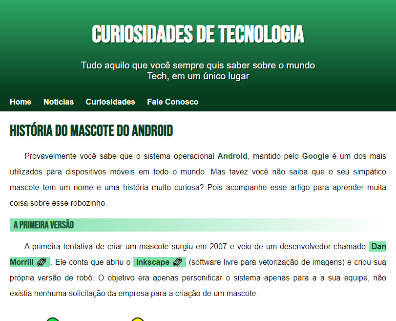

# História do Mascote do Android - Curso em Video

> Projeto Construido Durante o curso da plataforma Curso em Video

[Clique aqui para acessar](https://natandavinci.github.io/Android/)

## Tecnologias

- HTML
- CSS
- GITHUB

## Funcionalidade Novas

- Responsividade
- Posicionamento
- HTML Semântico
- Fontes
- Cores
- Listas

## Contato
 natanaelqueiroz969@gmail.com
